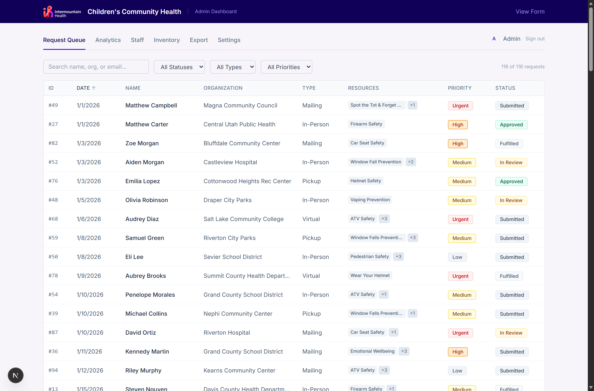
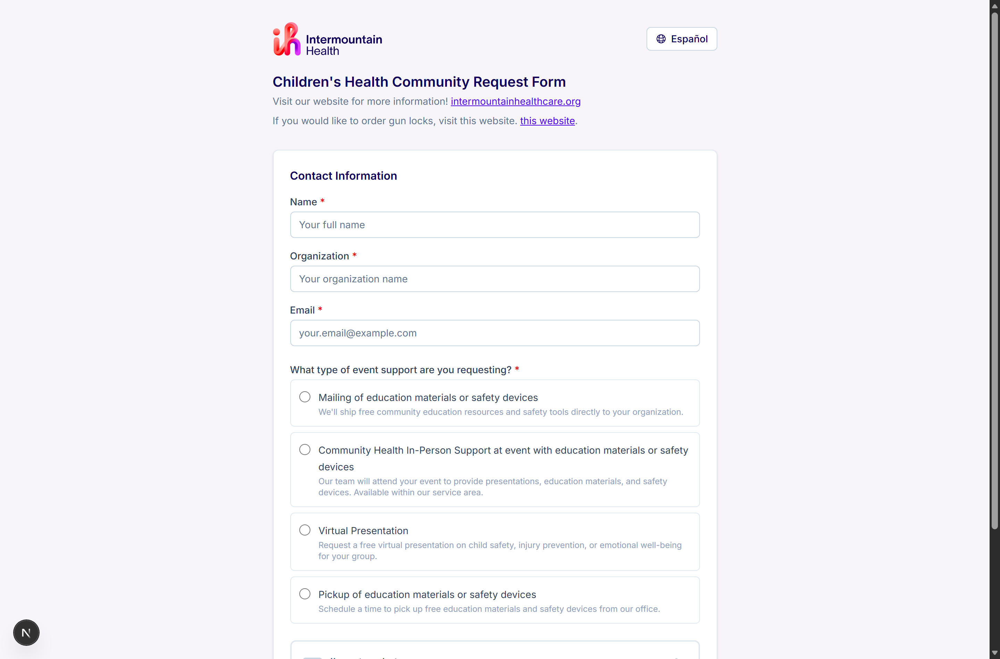
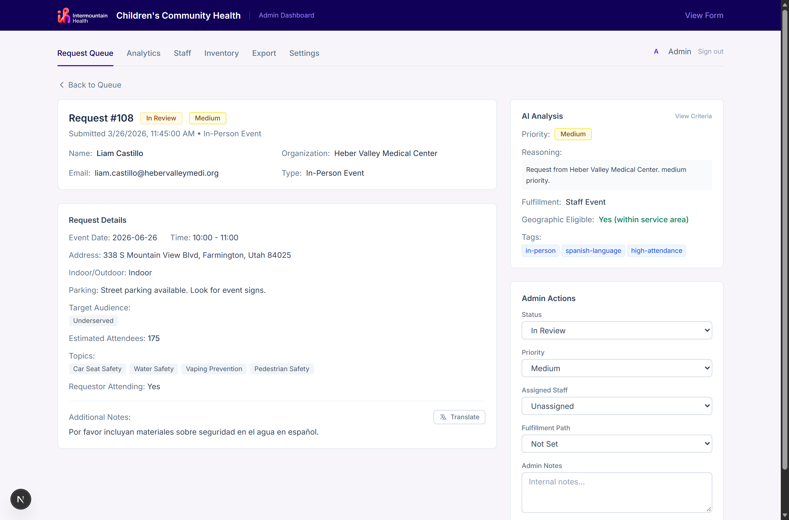
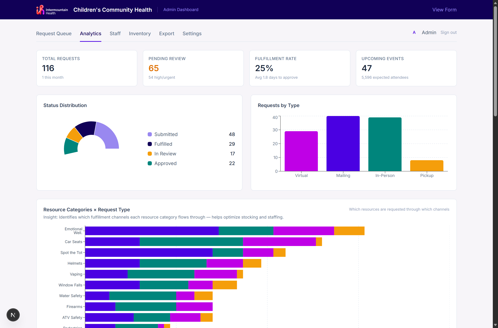
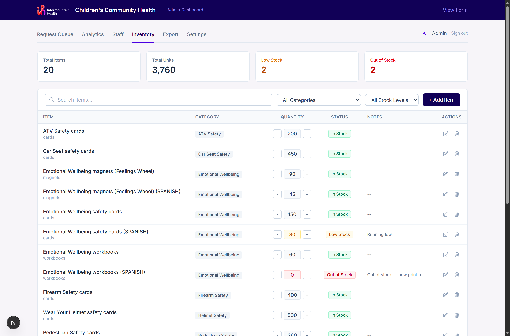
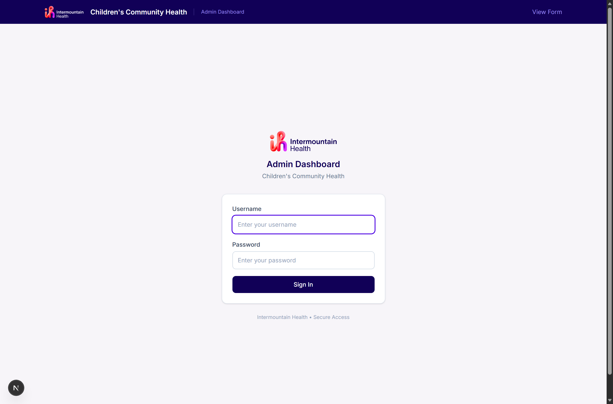

# CareCart

**Free child-safety materials, requested in two minutes and triaged in seconds.**

CareCart is an intake and fulfillment system for a children's community health team. Schools, clinics, city
programs, and nonprofits ask for free education materials, safety devices, and event support through one short
bilingual form. On the other side, staff get a single queue where every request arrives already prioritized,
routed to a fulfillment path, checked against inventory, and checked against the service area — so the work of
sorting the pile is done before anyone opens it.

It replaces the usual version of this process: an inbox, a spreadsheet, and someone reading each email to guess
what is urgent.

<p align="center">
  
</p>

---

## What it does

### For the community (public form)



- **English / Spanish toggle** on every string, including the material catalog.
- **Four request types** — mailing, in-person event support, virtual presentation, and pickup — each revealing
  only the fields it actually needs.
- **Material and safety-device selection** with quantities, drawn from live inventory.
- **Service-area validation** against real county data, so a request from outside the coverage area is caught at
  submission rather than three days later.
- Built to be accessible: labeled fields, keyboard-navigable, readable contrast.

### For staff (admin dashboard)

Every request that lands is analyzed by Claude before a human sees it. The model reads the request alongside
current stock levels and returns a structured classification — never free-form prose:



- **Priority** (low / medium / high / urgent) weighed across staffing cost, lead time, inventory availability,
  audience scale, and underserved-population reach — with the reasoning shown, so a coordinator can disagree with
  it and override in one dropdown.
- **Fulfillment path** — mail, staff event, virtual staff, or pickup.
- **Geographic eligibility** against the service area, with the reason stated.
- **Tags and flags** for fast filtering, plus on-demand translation of free-text notes submitted in Spanish.

The criteria behind the priority score are written once and shared between the model's prompt and the
"View Criteria" panel in the UI, so what staff read is exactly what the model was told.

| | |
|---|---|
|  |  |
| **Analytics** — volume, status mix, fulfillment rate, average days to approve, event pipeline, and which resources flow through which channels. | **Inventory** — stock levels per item with low-stock and out-of-stock states that feed straight back into prioritization. |

Also in the dashboard: a **staff directory** with roles, specialties, and assignment counts; **calendar invites**
(`.ics`) generated per approved event; **CSV export** of the request data; and **settings** for service areas and
handling rules.

---

## Quick start

```bash
npm install
npm run dev
```

Open <http://localhost:3000> for the public form, or <http://localhost:3000/admin> for the dashboard.

The repo ships a pre-seeded SQLite database — **116 mock requests, 10 staff members, 20 inventory items** — so the
dashboard is populated on first run with no setup.

**Demo login:** `admin` / `admin123`



AI classification and translation call the Anthropic API. Set a key to enable them:

```bash
export ANTHROPIC_API_KEY=sk-ant-...
```

Without a key the app still runs; requests simply arrive unclassified.

---

## Tech

| Layer | Choice |
|---|---|
| Framework | Next.js 16 (App Router), React 19, TypeScript |
| Styling | Tailwind CSS v4 |
| Data | SQLite via `better-sqlite3`, seeded and committed |
| AI | Claude via the Anthropic SDK, structured classification + translation |
| Auth | Session cookies signed with `jose`, passwords hashed with `bcryptjs` |
| Charts | Recharts |
| Calendar | `ical-generator` |

## Layout

```
app/
  page.tsx          public request form
  admin/            dashboard (queue, analytics, staff, inventory, export, settings)
  api/              requests, auth, ai (classify/translate/criteria), inventory, staff, calendar, export
components/         form and admin UI
lib/
  ai.ts             Claude classification
  ai-criteria.ts    priority criteria shared by prompt and UI
  db.ts             schema and queries
  i18n.ts           English / Spanish strings
  counties.ts       US county reference data for service-area checks
  calendar.ts       .ics invite generation
data/requests.db    seeded demo database
```

Built at an Intermountain Health hackathon, March 2026.
